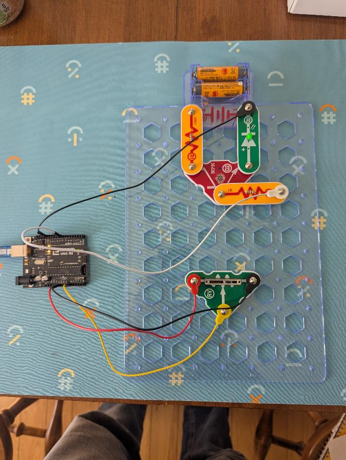
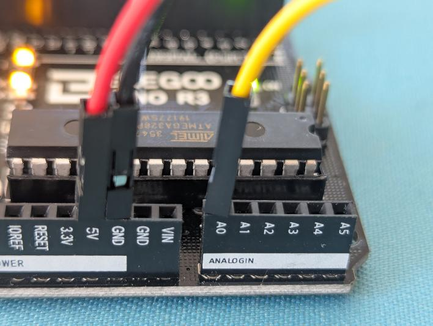
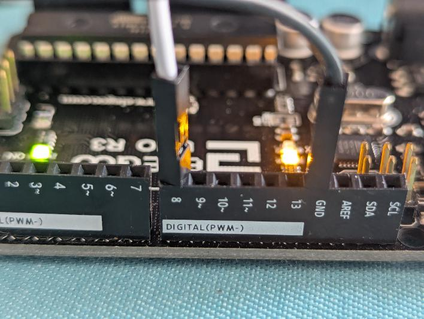

# Lesson 02: ADC Variable Delay

This lesson uses a three-terminal potentiometer to send an adjustable voltage to analog pin A0. The Arduino reads that voltage and uses it to change the pin-8 blink delay.

## How the Arduino Turns Voltage Into a Number

Voltage can slide smoothly from low to high, like moving a dimmer switch. The Arduino's **analog-to-digital converter**, or **ADC**, measures the voltage on A0 and chooses a whole-number value for it.

The Uno has a 10-bit ADC, so it can choose from 1,024 values. Those values are numbered **0 through 1023** because counting starts at 0. A voltage near 0 V gives a reading near 0, a voltage near 5 V gives a reading near 1023, and voltages in between give readings in between. This lets the program work with a changing voltage as a digital number.

## Keep the Lesson 01 Output Circuit

Leave the transistor and LED assembly from lesson 01 connected just as it was. Do not rebuild it or move its parts. Keep these two lesson 01 connections:

- Arduino GND connects to the existing assembly's ground so both circuits share the same ground.
- Arduino digital pin 8 connects to the existing NPN transistor base control point.

Lesson 02 adds the potentiometer connections below; it does not replace the pin-8 output circuit.

## Wire the Potentiometer

Disconnect the USB cable from the Arduino Uno before adding or changing any wires. The board must have no USB power while you build the circuit.

A potentiometer has two outer terminals and one center terminal called the **wiper**. Connect it as a voltage divider:

| Potentiometer terminal | Arduino Uno connection |
| --- | --- |
| One outer terminal | 5 V |
| Other outer terminal | GND |
| Center wiper | A0 |

The two outer terminals may trade places. Swapping them changes which turning direction raises the A0 voltage, but the voltage divider still works the same way.

## Circuit Reference Photos

These original, repository-owned photos show one completed Snap Circuits experiment connected to the Arduino Uno. Use the wiring table above as the connection guide, and ask a teacher to check your circuit before applying power.

The full circuit shows the variable resistor near the bottom and the transistor-controlled LED assembly near the top.

The variable resistor uses Arduino 5 V and GND across its outer terminals. Its center wiper connects to analog input A0.

The lesson 01 output assembly keeps its control connection to digital pin 8 and its shared-ground connection to Arduino GND.

## Safety Check

Ask a teacher to verify every connection before reconnecting the USB cable. Check that no wire or metal part directly joins Arduino 5 V to GND, because that would create a short circuit and could damage the board.

Keep the voltage on A0 between 0 V and 5 V. Use only the Arduino's 5 V and GND pins to power this potentiometer; do not connect a separate battery, power supply, or other externally powered analog signal to A0.

Make sure the center wiper is securely connected to A0. If A0 is left unconnected, or **floating**, it can pick up electrical noise and produce unstable readings that jump around even when no one turns the knob.